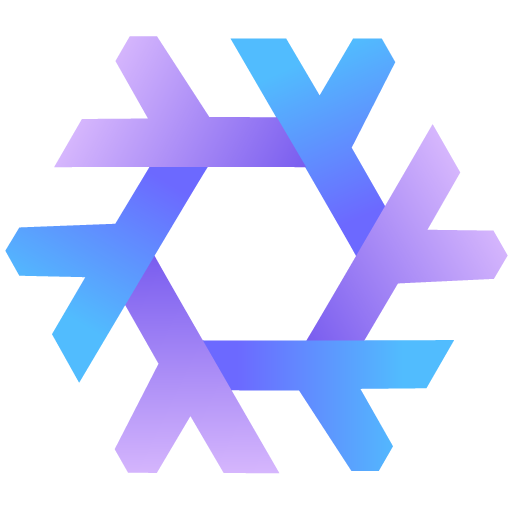
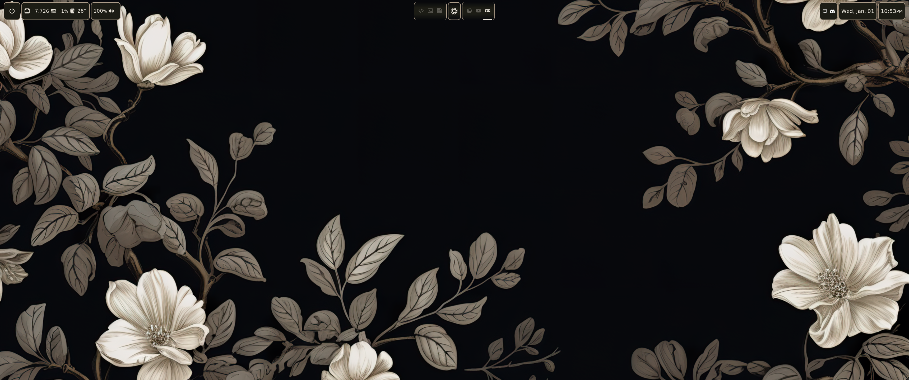
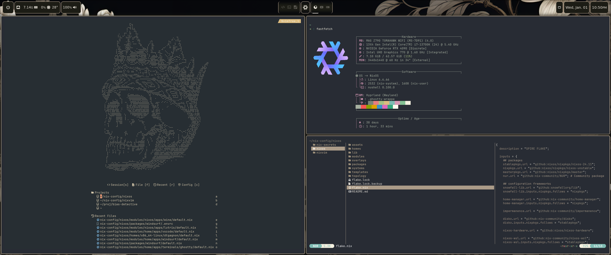

<h1 align="center">dtgagnon ❄️ NixOS Public Configuration</h1>

# Migrated to my personal Forejo git repository. While the config continues to evolve, updates will no longer be reflected on GitHub.

## Table of contents

- [Features](#-features)
- [File structure](#-file-structure)
- [Desktop preview](#%EF%B8%8F-desktop-preview)
  - [Hyprland](#-hyprland)
- [Software](#-software)
- [Hosts description](#%EF%B8%8F-hosts-description)
- [Keyboard](#%EF%B8%8F-keyboard)

## ✨ Features

- [X]❄️ Flakes -- for precise dependency management of the entire system.
- [X]🏡 Home Manager -- to configure all used software for the user.
- [X]💽 Disko -- for declarative disk management: luks + lvm + btrfs.
- [X]💽 Preservation -- Impermanence alternative that is more strictly declared. Only retains root files that are explicitly declared.
- [X]💈 Stylix -- to customize the theme for the entire system and the software you use.
- [ ]🍎 NixDarwin -- to declaratively customize MacOS.
- [ ]🔐 Lanzaboot -- to securely boot the system.
- [X]📁 Config file structure and modules with options.

## 📁 File structure

- [❄️ flake.nix](flake.nix) configuration entry point
- [1][👤🏡 Users & Homes](homes/) entry point for creating a home manager user
    - [🧩 modules](modules/home/) home manager modules
- [♻️ overlays](overlays/) all overlays
- [📃 lib](lib/) helper functions for creating configurations
- [🖥️💾 systems + hw](systems/) machine (host) configs incl. hardware
    - [🧩 modules](modules/nixos/) machine modules
- [📄 templates](templates/) templates

## 🖼️ Desktop preview

### ⚡ Hyprland

## 📘 Software

 - OS - [**`NixOS`**](https://nixos.org/)
 - WM - [**`Hyprland`**](https://hyprland.org/) or [-][**`SwayFX`**](https://github.com/WillPower3309/swayfx)
 - Theme - [**`Gruvbox-medium-dark`**]()
 - Wallpapers - [**`Packaged`**](https://github.com/dtgagnon/nix-config/tree/main/packages/wallpapers/wallpapers)
 - Editor - [**`Neovim`**](https://neovim.io/)
 - Bar - [**`Waybar`**](https://github.com/Alexays/Waybar)
 - Terminal - [**`Ghostty`**](https://https://ghostty.org/)
 - Shell - [**`Nushell`**](https://https://www.nushell.sh/)
 - Prompt - [**`Starship`**](https://starship.rs/)
 - File Manager - [**`Yazi`**](https://github.com/sxyazi/yazi)

## 🖥️ Hosts description

| Host | Board | CPU | RAM | GPU | OS | State |
| --- | --- | --- | --- | --- | --- | --- |
| DG-PC | MSI Z790 TOMAHAWK WIFI | i7-13700K | 64GB | NVIDIA RTX 4090 | NixOS | OK |
| spirepoint | MSI Something | i7-somethingK | 16GB | NVIDIA GTX 1050 Ti | NixOS | WIP |
| slim | Asus Zenbook 1st Gen | i5-something | 8GB | iGPU | NixOS | WIP |

## ⌨️ Keyboard

I use a QK65 with a standard QWERTY layout. Dreams to move to a modified Corne split using a modified [miryoku](https://github.com/manna-harbour/miryoku) layout.

- Switches: Zakus
- Keycaps: 8008 Double-shot PBT
